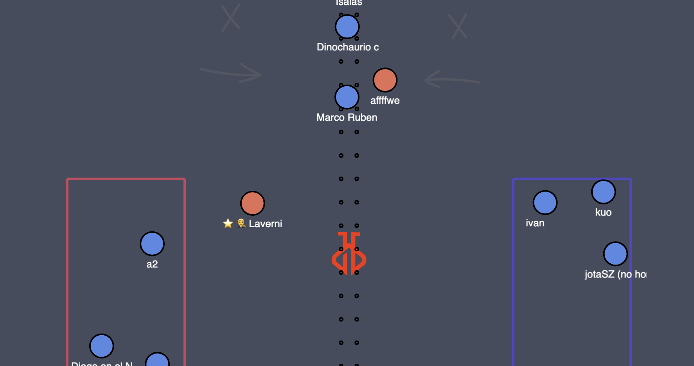

<h1 align="center">APEX HAXBALL</h1>
<p>
  <a href="https://github.com/APEX HAXBALL/hax-rs/blob/master/LICENSE" target="_blank">
    
  </a>
</p>

> Haxball Room Script for APEX HAXBALL



### 🚀 [Discord](https://discord.gg/Frg8Cr8UQb)

## Features

- [x] Real Soccer Map and Draft Map
- [x] Outs, Goal Kicks, Corners
- [ ] Free Kicks
- [ ] Offsides
- [x] Natural kicks (slight rotation)
- [x] Natural outs and ball passes
- [x] Draft System
- [x] Fully automatic

## Prerequisites

- NPM
- NodeJS

## Install

```sh
git clone git@github.com:APEX HAXBALL/apex-haxball.git
cd apex-haxball/
npm install
```

## Usage

Rename `config.example.ts` with `config.ts`. Insert **token** from https://haxball.com/headlesstoken into `config.ts`.

```ts
// config.ts

export default {
  roomName: `🌕   APEX HAXBALL 5V5 RS`,
  public: true,
  maxPlayers: 30,
  token: `YOUR_TOKEN_HERE`,
};
```

Run Server:

```sh
npm start
```

### How to play

Real Soccer gameplay with natural kicks and outs. Sprint, slide/tackle, superpowers, teamplay boost, ELO/ranked progression, fouls, cards, free kicks and offsides are not included.

### Commands

_[NOTE] It is **not** intended do pause/stop/start games manually, as well as change
maps (also through using commands). Most of the time it works, but the script was not
designed to handle manual actions._

- `!login your_admin_pass` - login as admin. It allows you to use `!rs` and
  `!draft`
- `!draft` - start draft. Stopping it before end result may result in a
  in server crash.
- `!rs` - change map to APEX HAXBALL

### Settings

Some script settings can be changed in `src/settings.ts`. Also, if you
change RS map physics, you should update settings values in
`src/settings.ts`.

## Author

👤 **Jakub Juszko**

- Website: https://APEX HAXBALL.com
- Github: [@APEX HAXBALL](https://github.com/APEX HAXBALL)
- LinkedIn: [@jakubjuszko](https://linkedin.com/in/jakubjuszko)

## 🤝 Contributing

This package is not published on NPM, because the script is self-contained and I do not expect anyone to
plug it into a bigger script.

Contributions, issues and feature requests are welcome!<br />Feel free to check [issues page](https://github.com/APEX HAXBALL/hax-rs/issues).

## Show your support

Give a ⭐️ if this project helped you!

## 📝 License

Copyright © 2024 [Jakub Juszko](https://github.com/APEX HAXBALL).<br />
This project is [MIT](https://github.com/APEX HAXBALL/hax-rs/blob/master/LICENSE) licensed.

---
